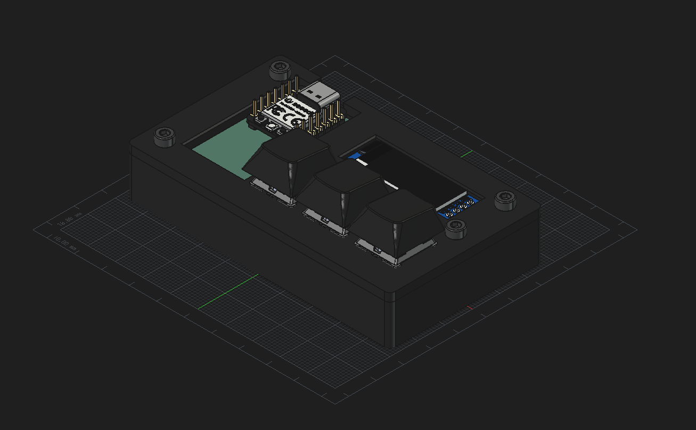
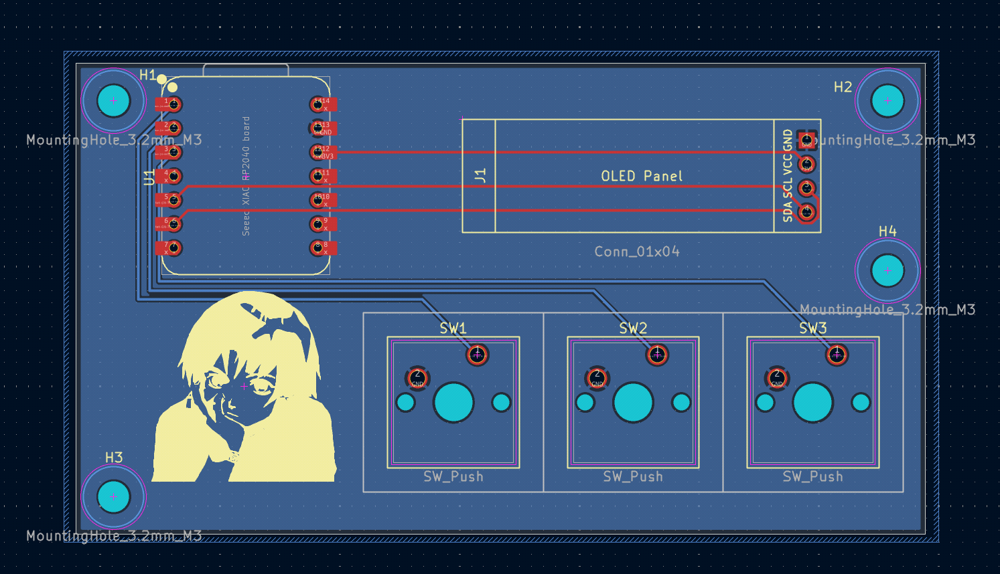
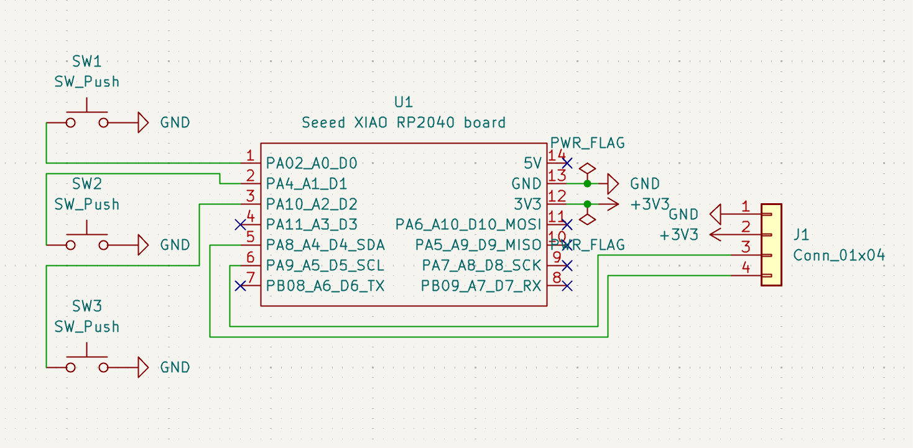

# MacroNAVI

MacroNAVI is a simple 3-key macropad with an OLED display, and uses KMK firmware. The reasoning for its lack of features is that I want it to serve as something small that I can take with me. The main standout is supposed to be the open case, which exposes the PCB, showing the controller and some cool art on the PCB. I built this macropad for [Hackpad](https://hackpad.hackclub.com/), as part of [Stardance](https://stardance.hackclub.com/).

## Features

- Three MX switches
- 128x32 OLED Display
- Exposed case
- KMK firmware

## Case

It has two case pieces, fitted together with four (4) screws and heat-set inserts. I used FreeCAD for the case design because I dislike Fusion360. The editable FreeCAD files, complete STEP assembly, and printable STLs are in `cad/`.

## PCB

PCB made using KiCad. The source files and project libraries are in `pcb/`, and manufacturing files are packaged in `pcb/gerbers.zip`.

## Schematic

Here's a screenshot of the schematic:

## Firmware
The firmware is in `firmware/main.py` and uses KMK on CircuitPython.
| Key | Current assignment |
| ----- | ---------------- |
| Left | F13 |
| Middle | F14 |
| Right | F15 |

The OLED is configured to display "COPLAND OS" and the key assignments. When I actually build it I will probably remap these keys to be media controls.

## Credits
Huge thanks to the [Alex Ren](https://github.com/qcoral) at Hackpad for running this awesome YSWS project.

## BOM
| Part | Quantity |
| --- | --- |
| Seeed Studio XIAO RP2040 | 1 |
| MX-style switches | 3 |
| White blank DSA keycaps, 1u | 3 |
| 0.91-inch 128×32 I²C OLED, GND-VCC-SCL-SDA | 1 |
| 1×7 male pin headers, 2.54 mm pitch | 2 |
| M3×16 mm screws | 4 |
| M3 heat-set inserts, 5 mm OD × 4 mm long | 4 |
| Custom MacroNAVI PCB | 1 |
| 3D-printed top plate | 1 |
| 3D-printed bottom case | 1 |
